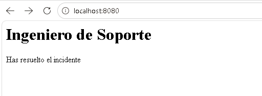

# 🛠️ Prueba Técnica — Ingeniero de Soporte N3: Diagnóstico de Microservicios

## Descripción del Incidente

Se reportó una caída crítica en el portal de clientes tras un despliegue reciente. El entorno consiste en tres servicios corriendo en contenedores Docker:

| Servicio | Imagen | Rol |
|----------|--------|-----|
| `nginx-proxy` | nginx:alpine | Balanceador de carga / punto de entrada (Puerto 8080) |
| `api-service` | node:18-alpine | Lógica de negocio (Node.js) |
| `database` | postgres:15-alpine | Motor de base de datos (PostgreSQL) |

---

## 🔍 Diagnóstico y Solución de Problemas

### Primer Cambio — Adición de Memoria Extra en `docker-compose.yml`

Al iniciar el entorno con `docker-compose up -d`, se obtuvieron errores al inicializar los contenedores. Revisando los logs creados para determinar que pudo haber causado el error al inicializar se encontró que la memoria asignada para el `api-service` no era suficiente. Al ejecutar `docker compose logs api-service` el proceso terminaba con el código **137**, lo que indica que el sistema operativo finalizó el proceso por falta de memoria (*OOMKilled*). Se corrigió el límite a `128M` dentro del archivo `docker-compose.yml`, que es el valor mínimo recomendado para un servicio Node.js. Como buena práctica, este valor también puede calcularse midiendo el consumo real con `docker stats` y colocando el doble para absorber picos de carga.


### Segundo Cambio — Coordinación de puertos para la conexión con el servicio API en `docker-compose.yml`

Una vez los contenedores se crearon exitosamente se obtuvo el siguiente error al tratar de conectar con el servicio directamente:


Al buscar especificamente en los logs creados por Docker se encontro con:

```
2026/05/07 19:55:00 [error] 30#30: *1 connect() failed (111: Connection refused)
while connecting to upstream, client: 172.18.0.1, server: ,
request: "GET / HTTP/1.1", upstream: "http://172.18.0.3:8080/", host: "localhost:8080"
```

Al revisar mas a fondo el archivo `nginx.conf`, se encontro que el puerto asignado no era el correcto para la conexión con la API. El upstream de nginx apuntaba al puerto `8080` del `api-service`, pero el servicio Node.js estaba configurado para escuchar en el puerto `4500` (definido en la variable de entorno `target_output` en el archivo `docker-compose.yml`).


**Impacto:** Nginx intentaba hacer proxy hacia un puerto que no tenía ningún proceso escuchando, resultando en `Connection refused`.

---
### Tercer Cambio — Adición de verificación healthcheck en `docker-compose.yml`

Algo que se habia denotado anteriorment es que el servicio de conexión a la API arrancaba sin esperar a que PostgreSQL estuviera completamente listo para recibir conexiones. Esto podría provocar errores de conexión a la base de datos durante el inicio, por lo que se añade una verificación para poder asegurar que el servicio corra unicamente cuando la conexión con PostgreSQL estuviera completamente implementado:

Inicialmente realizamos la verificación mirando que cada 5 sgs con un tiempo de espera de 5 sgs con un maximo de 5 intentos que la conexión este implementada correctamente:


Por último se añade que el servicio API no se inicie hasta que la conexión con la base de datos este completa:


```

**Impacto:** Sin el healthcheck, el `api-service` se conectaba antes de que PostgreSQL terminara de inicializar, causando errores intermitentes de conexión.

---

## ✅ Archivos Corregidos

### `nginx.conf`

```nginx
events { worker_connections 1024; }

http {
    upstream api_servers {
        server api-service:4500;  # ← Corregido: de 8080 a 4500
    }

    server {
        listen 80;

        location / {
            proxy_pass http://api_servers;
            proxy_set_header Host $host;
            proxy_set_header X-Real-IP $remote_addr;
            proxy_set_header X-Forwarded-For $proxy_add_x_forwarded_for;
        }
    }
}
```

### `docker-compose.yml`

```yaml
version: '1'

services:
  database:
    image: postgres:15-alpine
    container_name: lappiz-db-server
    environment:
      POSTGRES_USER: admin
      POSTGRES_PASSWORD: password123
      POSTGRES_DB: main_db
    healthcheck:                                         # ← AÑADIDO
      test: ["CMD-SHELL", "pg_isready -U admin -d main_db"]
      interval: 5s
      timeout: 5s
      retries: 5

  api-service:
    image: node:18-alpine
    container_name: lappiz-api
    depends_on:
      database:
        condition: service_healthy                       # ← CORREGIDO
    environment:
      DB_HOST: 'database'
      DB_PORT: 5432
      target_output: 4500
    deploy:
      resources:
        limits:
          memory: 128M
    command: >
      node -e "
      const http = require('http');
      const net = require('net');
      const target = process.env.target_output;

      const checkDb = () => {
        return new Promise((r) => {
          const s = net.createConnection(process.env.DB_PORT, process.env.DB_HOST, () => { s.end(); r(true); });
          s.on('error', () => r(false));
        });
      };

      const server = http.createServer(async (req, res) => {
        const dbOk = await checkDb();
        res.writeHead(dbOk ? 200 : 503, { 'Content-Type': 'text/html' });
        res.end(dbOk ? '<h1>Ingeniero de Soporte</h1><label>Has resuelto el incidente</label>' : '<h1>Bd No contectada</h1>');
      });

      server.listen(target, '0.0.0.0', () => {
        console.log('Servidor N3 en ejecución. Escaneando dependencias...');
      });
      "

  nginx-proxy:
    image: nginx:alpine
    container_name: lappiz-proxy
    ports:
      - "8080:80"
    volumes:
      - ./nginx.conf:/etc/nginx/nginx.conf:ro
    depends_on:
      - api-service
```

---

### Resultado esperado




---

## 📋 Resumen de Cambios

| Archivo | Cambio | Motivo |
|---------|--------|--------|
| `docker-compose.yml` | Añadido memoria extra | Poder asignar memoria que permite el arranque normal de la aplicación |
| `nginx.conf` | Puerto upstream: `8080` → `4500` | El api-service escucha en 4500, no en 8080 |
| `docker-compose.yml` | Añadido `healthcheck` en `database` | Verificar que Postgres está listo antes de aceptar conexiones |
| `docker-compose.yml` | `depends_on` con `condition: service_healthy` en `api-service` | Evitar que la API arranque antes de que la BD esté disponible |
